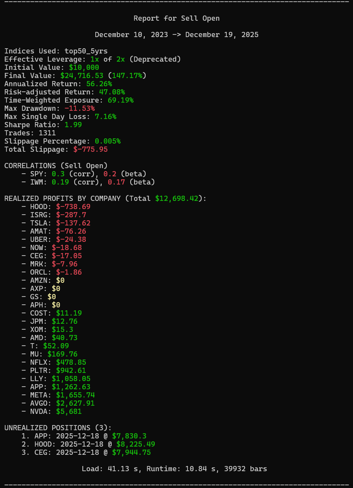
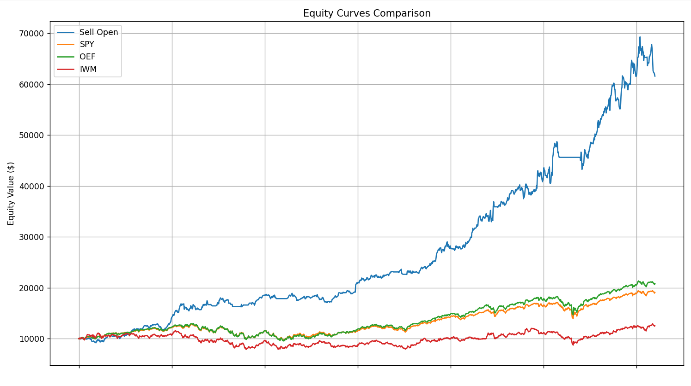

# Trayd

## A comprehensive backtesting engine with built-in data aggregation form Yahoo Finance, Massive, and Financial Modelling Prep.

This project aims to be a free-to-use, efficient system for backtesting algorithmic trading strategies. It features:

- Data aggregation
- Statistical analysis of strategies
- A suite of sample strategies
- The option for 5 minute or 1 day ticks

Data is aggregated from Yahoo Finance and Massive, with Massive requiring an API key in the .env.

## How to use

1. Clone this project
2. Run pip install -e .
3. Add Massive.com API key to .env
4. Create or modify an existing algorithm in src/trayd/algorithms
5. Modify src/trayd/main to test this algorithm

Data aggregation can take a while depending on your Massive.com subscription tier, the index you are using, and the timeframe you are backtesting. However, this data will be stored locally as .parquet files and will never need to be redownloaded.

## Output Examples

## Disclaimer

I would recommend that you use this repo as a starting point for a backtesting engine, instead of paying for one. You may have to modify your repo to accomodate your specific use cases but this repo aims to give you a starting point for backtesting.
